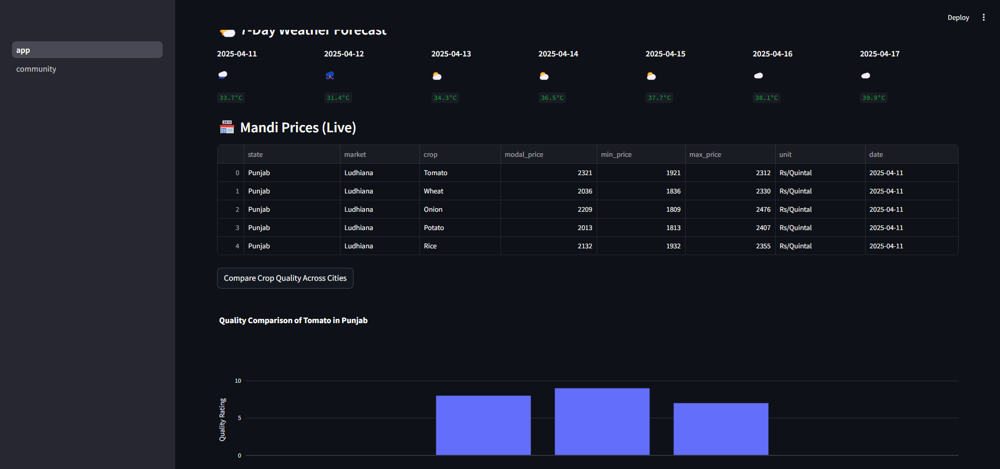
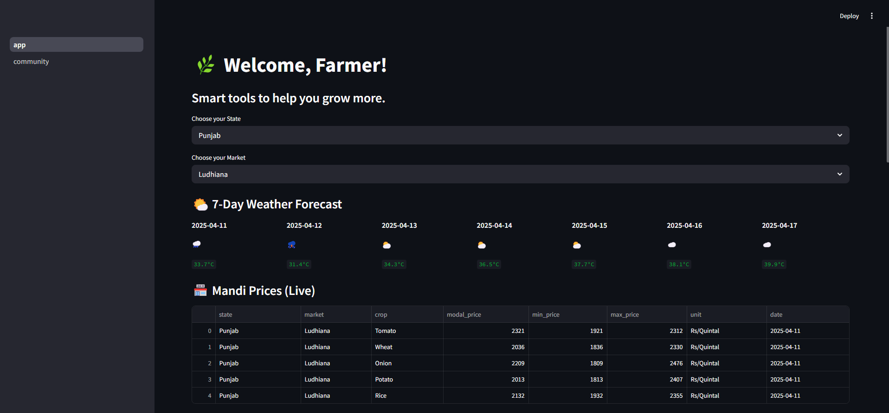
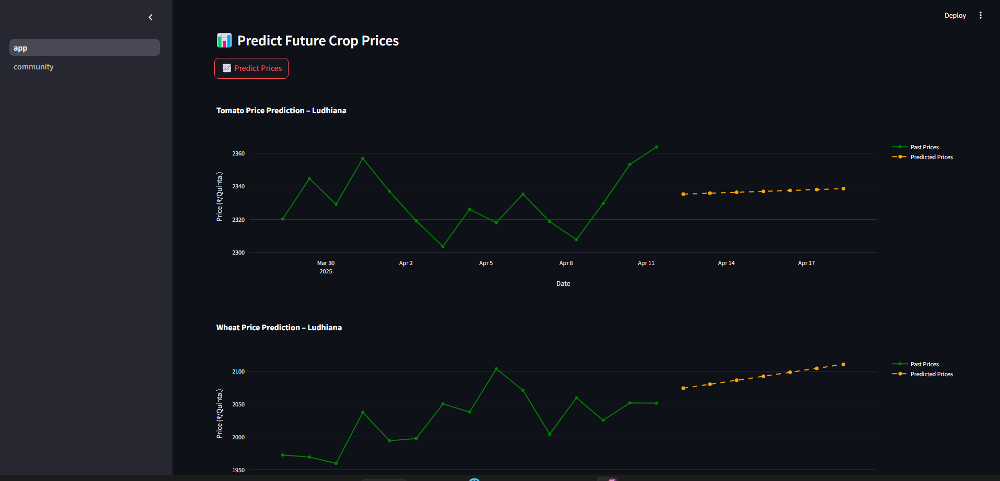
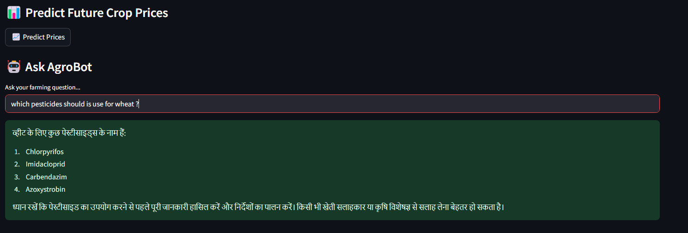
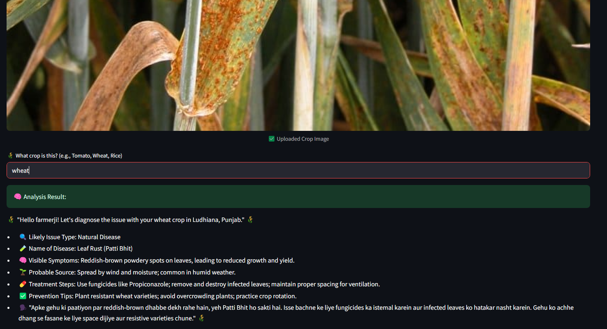
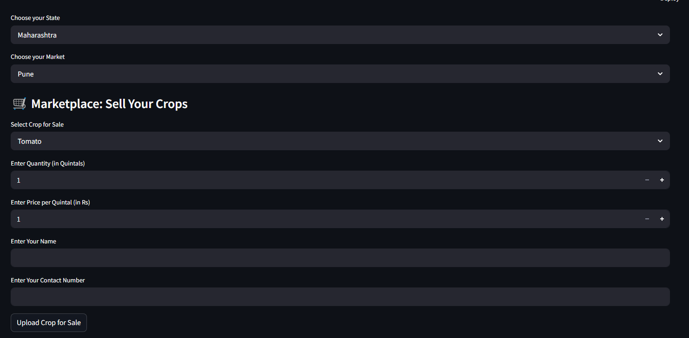
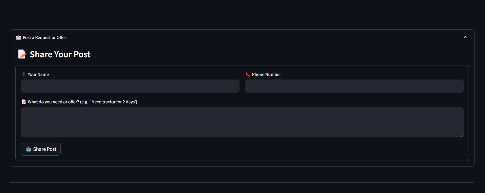

# AgroSphere: Smart Agriculture App

**AgroSphere** is an agricultural tool designed to help farmers get real-time data about crop prices, weather forecasts, disease detection, and a marketplace to sell crops. This app provides AI-powered solutions and tools to enhance farming practices.

## Idea

The idea behind **AgroSphere** is to provide a comprehensive platform for farmers to access real-time data and services that help them improve their farming practices. It includes features such as:

- **Mandi Price Scraping**: Live crop price data from various markets in India.
- **Weather Forecasting**: Accurate 7-day weather forecasts to help farmers plan their farming activities.
- **Disease Detection**: AI-powered crop disease detection from uploaded images, providing possible causes and solutions.
- **Marketplace**: A platform where farmers can upload their crops, quantity, and prices to sell directly.

The platform integrates several APIs, including agricultural market data and weather services, to ensure that farmers have the best tools at their disposal.

## Features

- **Real-time Mandi Prices**: Farmers can access live crop prices based on their selected state and market.
- **Weather Forecast**: 7-day weather forecasts to help farmers prepare for different weather conditions.
- **Disease & Adulteration Detection**: Upload an image of a crop to detect diseases or adulteration, with AI-based analysis.
- **Marketplace for Selling Crops**: A platform for farmers to list their crops with details like quantity, price, and contact information.
- **Predict Future Crop Prices**: Use linear regression to predict the price of a crop for the next 7 days.

Code Documentation
1. app.py
This is the main file that runs the AgroSphere app. It uses the Streamlit framework to create a user interface that integrates with various APIs for weather, mandi prices, and disease detection.

Key components of the app.py:

State and Market Selection: Allows the user to choose their state and market to view live mandi prices.

Weather Forecast: Displays a 7-day weather forecast based on the user’s location.

Crop Disease Detection: Upload a crop image and get disease or adulteration analysis using AI.

Price Prediction: Predicts the future price of a crop using a linear regression model.

2. scrape_agmarknet_prices() function
This function simulates scraping live mandi prices for various crops. It generates mock data that represents the prices for different crops (Tomato, Wheat, Onion, Potato, and Rice).

python
Copy
def scrape_agmarknet_prices(state, market):
    today = date.today().strftime('%Y-%m-%d')
    crops = ["Tomato", "Wheat", "Onion", "Potato", "Rice"]
    prices = []

    for crop in crops:
        prices.append({
            "state": state,
            "market": market,
            "crop": crop,
            "modal_price": 2000 + hash(crop + market) % 400,
            "min_price": 1800 + hash(crop + market) % 200,
            "max_price": 2200 + hash(crop + state) % 300,
            "unit": "Rs/Quintal",
            "date": today
        })

    df = pd.DataFrame(prices)
    df.to_csv("mandi_data.csv", index=False)
    return df
3. client.chat.completions.create()
This function is used for handling AI-powered responses. It analyzes crop disease images and provides potential causes and solutions based on the uploaded image. The responses are based on OpenAI’s GPT model, specifically fine-tuned for agricultural topics.

python
Copy
response = client.chat.completions.create(
    model="gpt-3.5-turbo",
    messages=[
        {"role": "system", "content": "You are AgroBot, helping farmers in simple Hinglish."},
        {"role": "user", "content": prompt}
    ]
)

Conclusion
AgroSphere is an innovative and powerful tool aimed at improving farming efficiency by providing real-time data, disease detection, and a marketplace for farmers. By integrating AI and various data sources, it offers solutions to common challenges faced by farmers in India.

#run

pip install -r requirements.txt

4. Run the App

streamlit run app.py
